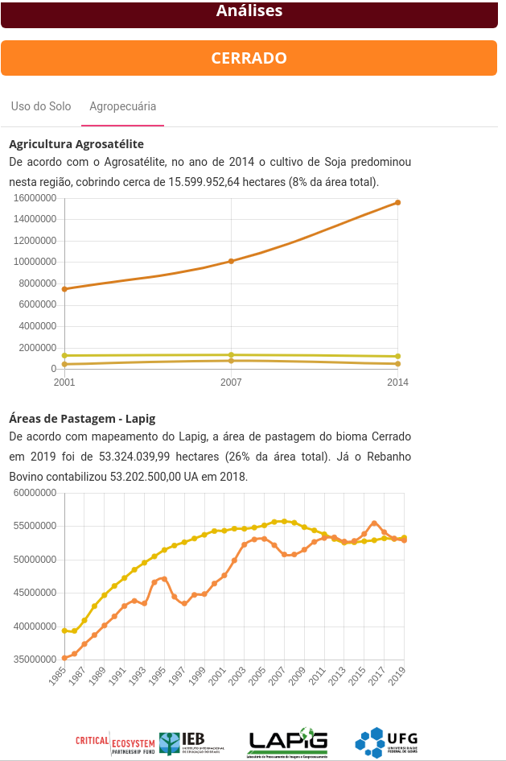

# Funcionalidades

## Dashboard 

O dashboard da plataforma de conhecimento do cerrado é formado por elementos principais:

**1 - Controle de Visualização**

Permite o controle do nível de zoom do mapa, além de ocultar e ativar a visualização da “Camada de Dados”.  

**2 - Camada de Dados**

Agrega todos os [dados](/01-guia_dados_geograficos/) que podem ser exibidos no mapa:

Também permite ao usuário, com opções agrupadas em abas: 
  * Escolha do mapa base: 
  

 

  *Seleção dos limites que são mostrados no mapa:  
  

* Upload de uma área de interesse permite a submissão de arquivos shapefile e geojson (compactados em .zip) ou .kml e .kmz (produzidos pelo Google Earth). Após a submissão do arquivo espacial, os limites da área de interesse já podem ser visualizados no mapa. Um token, numérico e em QR Code, também é criado para eventuais compartilhamentos.

  

**3 - Mapa interativo**

Área onde todas as camadas de dados são visualizadas.

**4 - Legenda**

Legenda correspondente às camadas de dados habilitadas para visualização.

**5 - Análises**

As análises permitem os usuários ver os dados em forma de gráficos. Os gráficos são atualizados conforme a região de interesse.
 

O gráfico de uso do solo também é atualizado além da área de interesse do usuário, ao selecionar um outro mapa de uso do solo, como Terraclass ou Probio, o gráfico irá condizer com o mapa selecionado. Para o dado do Mapbiomas ao alterar o ano o gráfico também é atualizado.

Por meio da aba Agropecuária é possível analisar os dados de Agricultura de Soja, Milho e Algodão de acordo com a Agrosatélite  para os anos de 2014, 2007 e 2001. 
Outro gráfico disponível para análise é o de Áreas de Pastagem elaborado pelo Lapig a partir do ano de 1985. Para deixar a análise ainda mais rica podemos comparar no mesmo gráfico o rebanho bovino.

Ao selecionar um estado ou município como região de interesse é possível gerar um relatório mais completo e com a possibilidade de imprimir/exportar para PDF.

